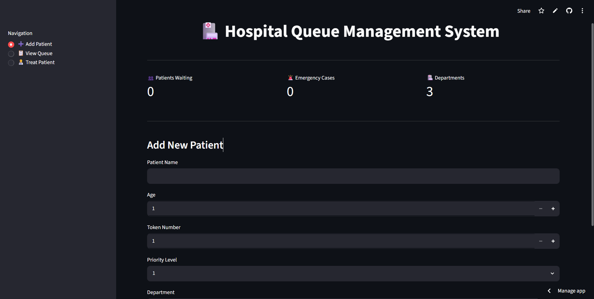
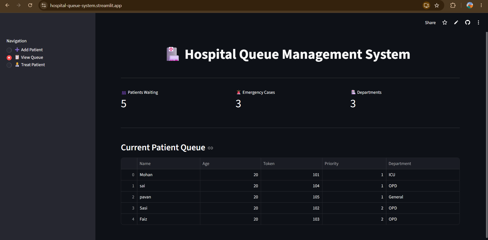
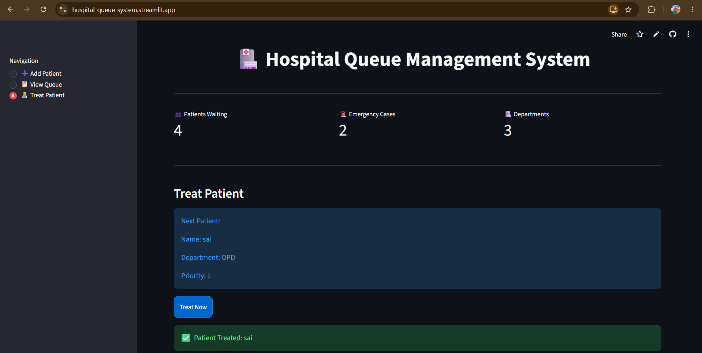

# 🏥 Hospital Queue Management System

A web-based Hospital Queue Management System developed using Python and Streamlit.

## 🚀 Live Demo

🌐 Streamlit App:
https://hospital-queue-management-system-66jkeail3mx.streamlit.app/

## 📌 Project Description

This project helps hospitals manage patient queues efficiently using the Priority Queue concept from Data Structures.

Patients are assigned different priority levels based on the severity of their condition:

- Priority 1 → Emergency
- Priority 2 → Visiting
- Priority 3 → Regular Checkup
- Priority 4 → Medicine

Patients with higher priority are treated before others.

## ✨ Features

- Add New Patients
- Assign Priority Levels
- Department Selection
- View Current Queue
- Treat Patients Based on Priority
- Interactive Web Interface
- Streamlit Deployment

## 🛠 Technologies Used

- Python
- Streamlit
- Data Structures
- Priority Queue
- Git & GitHub

## 📷 Screenshots

### Home Page



### Queue Management



### Patient Treatment



## ▶️ Run Locally

Clone the repository:

```bash
git https://github.com/sasidharthippana-commits/Hospital-queue-management-system.git
```

Move into project folder:

```bash
cd Hospital-queue-management-system
```

Install dependencies:

```bash
pip install -r requirements.txt
```

Run Streamlit app:

```bash
streamlit run app.py
```

## 🎯 Future Improvements

- Database Integration
- Doctor Dashboard
- Patient Login System
- Appointment Booking
- Analytics Dashboard

## 👨‍💻 Author

Sasidhar Thippana

GitHub:
https://github.com/sasidharthippana-commits